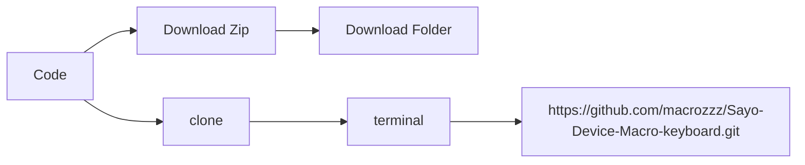

# Welcome to Sayo Device Macro Keyboard Guide!

Hi! I'm your **instructor**  and i will guide you on how to use this keyboard and tips and tricks.

If you came from youtube, you can just download using [https://dl.sayobot.cn/setting_v3.zip](https://dl.sayobot.cn/setting_v3.zip)

Please note, the software in this repo is downloaded from sayo bot [website](https://osu.sayobot.cn/download/) and has not been modified in anyway. 

## Download or clone

# Youtube videos

I have made a bunch of youtube videos for you to visually understand the keyboard
Link:  [Youtube playlist](https://www.youtube.com/watch?v=Y-PFuFkAugc&list=PLYkiFc5F_qra9-jqyWB3uHS_9kTsK_j8U&pp=iAQB)

## Chapters on Playlist

1. [**Device Setup**](https://youtu.be/Y-PFuFkAugc)
2. [**Getting familiar with interface**](https://youtu.be/U6PEyPaTVLM)
3. [**Modifiers on keys**](https://youtu.be/c8MtxwHuZcQ)
4. [**Multiple key combination**](https://youtu.be/aexajiGBvGE)
5. [**Light modes**](https://youtu.be/GMQ6JtYa0eQ)
6. [**Key Triggers**](https://youtu.be/6cBuQiphJ7Q)
7. [**Colors**](https://youtu.be/sIADiOakyhs)
8. [**Multimedia and mouse**](https://youtu.be/lzwMZGozSa0)

## This is my affiliate link if you interested to buy this keyboard

Link:  [ali express](https://s.click.aliexpress.com/e/_DE7c8gv)

## Channel name: [**Macro Keyboardz**](https://www.youtube.com/@MacroKeyboardz)

## Star this repository

If you want premade templates that you can just inport, don't forget to give it a star ⭐️. for me to know you guys want it

> ✨✨✨✨✨

## Keys assigning is not the same in windows and mac. For eg.

| Commands        |Mac                          |Windows                         |
|----------------|-------------------------------|-----------------------------|
| Copy			 | `Command + c`            	 |      `Ctrl + c`     		   |
|Paste           |`Command + v`           		 |`Ctrl + v`                   |
|Cut         	 |`Command + x`					 |`Ctrl + x`				   |

## Programming a specific keyboard shortcut

Open the issue with as much details as you can, including name of the software for eg. capcut, keyboard shortcut for eg. Command + b, action: split

